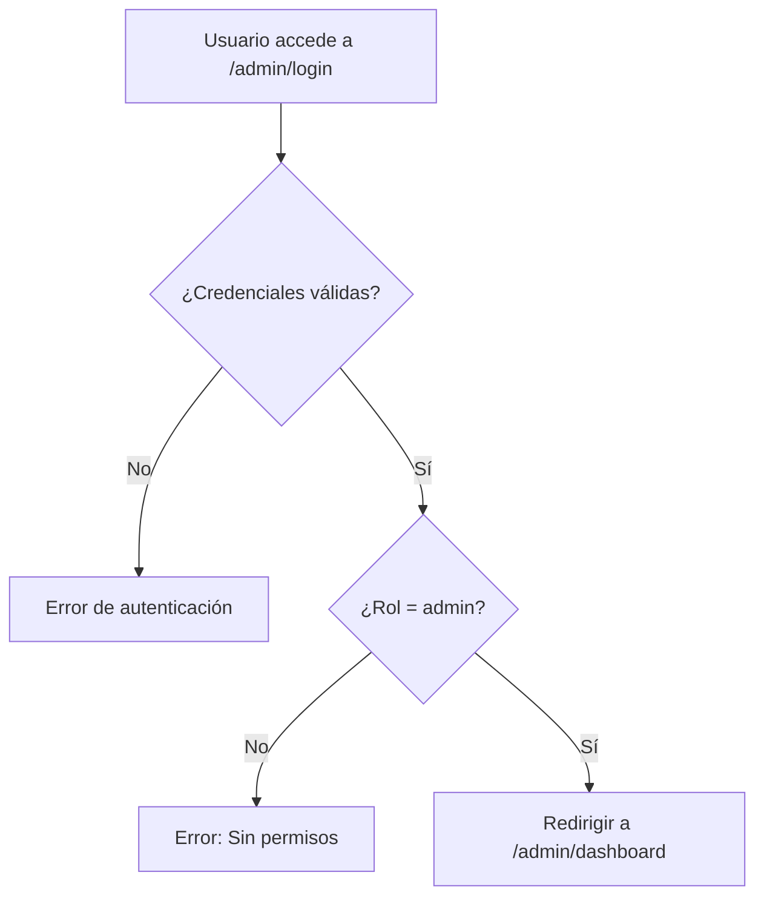

# Panel de Administrador - VerdeScan

## Descripción

El Panel de Administrador permite gestionar cuentas de promotores (kioskeros) y ecopuntos de manera centralizada. El administrador puede crear, visualizar y eliminar cuentas con sus respectivos usuarios y contraseñas.

## Características

- ✅ Crear cuentas de promotores y ecopuntos
- ✅ Visualizar todas las cuentas activas
- ✅ Eliminar cuentas cuando sea necesario
- ✅ Autenticación segura solo para administradores
- ✅ Interfaz intuitiva y moderna

## Configuración Inicial

### 1. Ejecutar las Migraciones de Base de Datos

Primero, debes ejecutar la migración SQL en tu instancia de Supabase:

1. Abre tu proyecto de Supabase
2. Ve a SQL Editor
3. Ejecuta el archivo `migrations/admin-and-staff-accounts.sql`

Este script creará:
- Campo `role` en la tabla `users`
- Tabla `staff_accounts` para gestionar cuentas de promotores y ecopuntos
- Políticas de seguridad (RLS) para proteger el acceso

### 2. Crear tu Primera Cuenta de Administrador

Después de ejecutar las migraciones, necesitas crear tu primera cuenta de administrador. Ejecuta este SQL en Supabase:

```sql
-- Actualiza el email con el de tu cuenta
UPDATE users
SET role = 'admin'
WHERE email = 'tu-email-admin@example.com';
```

**Importante:** Debes tener una cuenta de usuario existente en Supabase Auth antes de ejecutar este comando.

### 3. Acceder al Panel

Una vez configurada tu cuenta de administrador:

1. Navega a: `http://localhost:3000/admin/login` (o tu dominio en producción)
2. Inicia sesión con tus credenciales de administrador
3. Serás redirigido al panel de administrador

## Uso del Panel

### Crear Cuentas

1. En el panel de administrador, completa el formulario "Crear Nueva Cuenta"
2. Ingresa:
   - **Nombre de Usuario**: Un nombre único para la cuenta
   - **Contraseña**: Mínimo 6 caracteres
   - **Tipo de Cuenta**: Selecciona "Promotor / Kioskero" o "Ecopunto"
3. Haz clic en "Crear Cuenta"

### Visualizar Cuentas

Todas las cuentas activas se muestran en la sección "Cuentas Activas":
- 👥 Icono azul = Promotor / Kioskero
- 🏪 Icono morado = Ecopunto

### Eliminar Cuentas

1. Localiza la cuenta que deseas eliminar
2. Haz clic en el botón "Eliminar"
3. Confirma la acción en el diálogo de confirmación
4. La cuenta será eliminada permanentemente

## Estadísticas

El panel muestra estadísticas en tiempo real:
- Total de Promotores / Kioskeros
- Total de Ecopuntos
- Total de Cuentas Activas

## Seguridad

### Políticas Implementadas

- **Autenticación Requerida**: Solo usuarios autenticados pueden acceder
- **Verificación de Rol**: Solo usuarios con rol 'admin' pueden acceder al panel
- **Row Level Security (RLS)**: Todas las operaciones están protegidas con políticas RLS
- **Validaciones**: Las contraseñas deben tener mínimo 6 caracteres

### Mejoras Recomendadas para Producción

1. **Encriptación de Contraseñas**:
   - Actualmente se usa una encriptación simple (Base64)
   - **Se recomienda usar bcrypt o argon2 en producción**

2. **Autenticación de Dos Factores (2FA)**:
   - Implementar 2FA para cuentas de administrador

3. **Auditoría**:
   - Registrar todas las acciones de creación/eliminación de cuentas

4. **Límites de Tasa (Rate Limiting)**:
   - Implementar límites para prevenir ataques de fuerza bruta

## Estructura de Archivos

```
src/
├── app/
│   ├── admin/
│   │   ├── login/
│   │   │   └── page.tsx           # Página de login del admin
│   │   └── dashboard/
│   │       └── page.tsx           # Panel principal del admin
│   └── api/
│       └── admin/
│           └── staff/
│               ├── route.ts       # GET/POST - Listar y crear cuentas
│               └── [id]/
│                   └── route.ts   # DELETE - Eliminar cuentas
├── supabase/
│   └── types.ts                   # Tipos TypeScript actualizados
└── migrations/
    └── admin-and-staff-accounts.sql  # Migración de base de datos
```

## Tipos de Cuenta

### Promotor / Kioskero
Cuentas para personas que gestionan puntos de reciclaje en kioscos o comercios locales.

### Ecopunto
Cuentas para puntos de reciclaje más grandes o especializados.

## Flujo de Autenticación



## API Endpoints

### POST /api/admin/staff
Crear una nueva cuenta de staff.

**Request:**
```json
{
  "username": "kioskero1",
  "password": "contraseña123",
  "account_type": "promotor"
}
```

**Response:**
```json
{
  "message": "Cuenta creada exitosamente",
  "account": {
    "id": "uuid",
    "username": "kioskero1",
    "account_type": "promotor",
    "created_at": "2025-10-26T..."
  }
}
```

### GET /api/admin/staff
Listar todas las cuentas de staff.

**Response:**
```json
{
  "accounts": [
    {
      "id": "uuid",
      "username": "kioskero1",
      "account_type": "promotor",
      "created_at": "2025-10-26T...",
      "is_active": true
    }
  ]
}
```

### DELETE /api/admin/staff/[id]
Eliminar una cuenta de staff.

**Response:**
```json
{
  "message": "Cuenta eliminada exitosamente"
}
```

## Solución de Problemas

### No puedo acceder al panel
1. Verifica que hayas ejecutado las migraciones
2. Verifica que tu usuario tenga el rol 'admin'
3. Verifica que estés autenticado en Supabase

### Error al crear cuentas
1. Verifica que el nombre de usuario sea único
2. Verifica que la contraseña tenga al menos 6 caracteres
3. Verifica la conexión con Supabase

### Error de permisos
1. Verifica que las políticas RLS estén creadas correctamente
2. Verifica que tu usuario tenga el rol 'admin'

## Soporte

Para reportar problemas o sugerencias, contacta al equipo de desarrollo.
